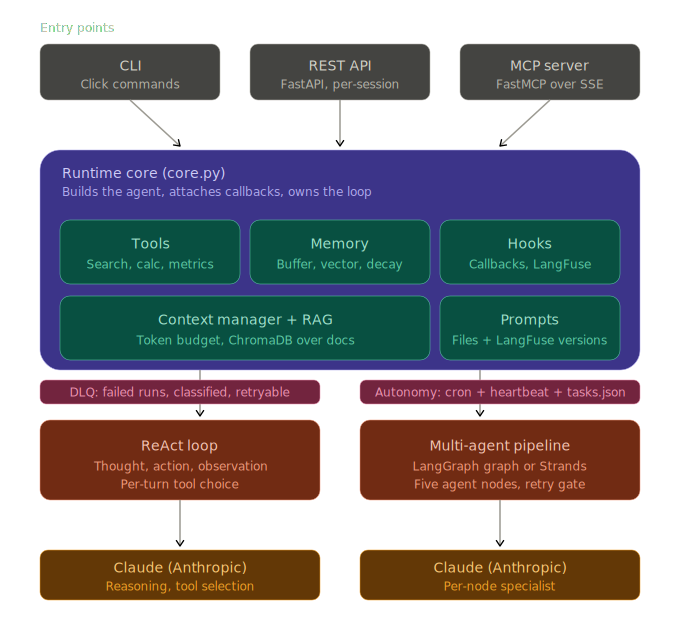
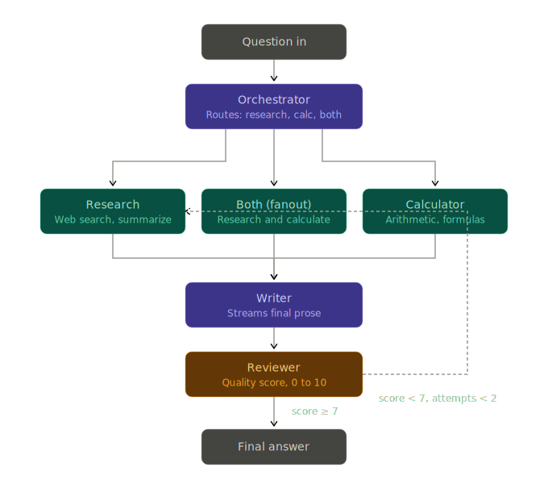
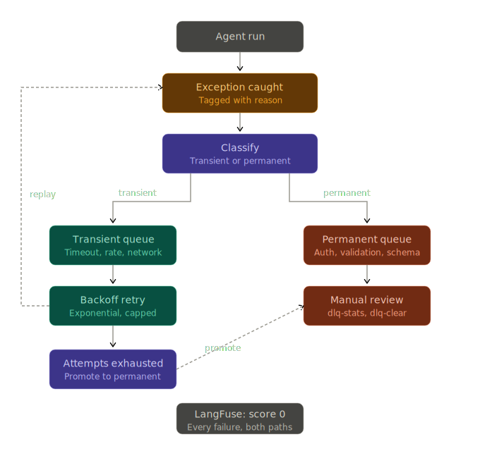

# agent-runtime-layers


A small research agent — **Claude, LangChain, LangGraph, and Strands** — built up in
**twenty-one deliberate layers**, each adding one agent-runtime capability. The core is a
ReAct agent; later layers add a LangGraph multi-agent pipeline, and the same pipeline
rebuilt with Strands, as contrasting paradigms. It's a hands-on project for
understanding how agent frameworks actually work under the hood: the agent loop, tool
calling, memory, streaming, lifecycle hooks, production tracing, a CLI, a REST API,
tests + evals, MCP (Model Context Protocol) in both directions, file/LangFuse-based
prompt management, vector-store memory, a LangGraph multi-agent pipeline, token-budget
context management with RAG, a LangGraph-vs-Strands comparison, age-based memory decay,
a streaming multi-agent graph, autonomous (cron + heartbeat) operation, a dead-letter
queue for failed runs, a composed skill, and — the final layer — running the whole agent
inside an **NVIDIA OpenShell** sandbox under a declarative network/filesystem policy.

```bash
uv run python agent.py ask "What is a Merkle tree?"
```

## The twenty-one layers

The agent was built incrementally; each layer adds one capability on top of the last.

| Layer | Capability | Runtime concept |
|---|---|---|
| **1 — ReAct agent + tools** | Single-shot Q&A with tool use | The agent loop, tool calling, and the ReAct text protocol. The LLM picks which tool per step; the executor just runs the loop. |
| **2 — Conversation memory** | Remembers earlier turns | Memory is *string concatenation into the prompt*. The LLM is stateless every call; continuity is replayed history (`ConversationBufferMemory` → `{chat_history}`). |
| **3 — Interactive loop** | Multi-turn REPL | Session lifecycle and state ownership — the executor and its memory are built once, before the loop, so context persists. |
| **4 — Streaming output** | Final answer streams token-by-token | Token streaming vs. step streaming: `astream_events` exposes the chat model's individual tokens, surfaced via `async for`. |
| **5 — Custom tool + hooks** | A domain tool + explicit observability | Callbacks are the framework's lifecycle hooks — `on_tool_start/end`, `on_llm_start/end` — the explicit version of what `verbose=True` does implicitly. |
| **6 — Production observability** | Structured traces in LangFuse | Same callback mechanism, durable structured spans (tool/LLM, latency, tokens) instead of stdout. Degrades gracefully to print hooks when unconfigured. |
| **7 — CLI with multiple front doors** | One agent, several entry points | A Click CLI; memory persisted to disk so it survives across separate command processes. Single-shot `ask` uses a memory-free agent to keep its prompt small. |
| **8 — Separation of concerns + REST API** | Modular package; an HTTP front door | Split into `tools` / `hooks` / `core` / `api` / `agent` with one-way imports, plus a FastAPI server. The runtime is decoupled from its delivery — CLI and API share the same core; the API isolates memory per `session_id`. |
| **9 — Testing + evals** | Automated quality gate | pytest (`tests/`) for deterministic plumbing with the LLM stubbed; evals (`evals/`) for probabilistic agent behavior — tool/answer assertions and LLM-as-judge relevance scores written to LangFuse. Tests answer "does it work?"; evals answer "is the answer good?" |
| **10 — MCP integration** | Speak MCP both ways | **Client:** wrap the official filesystem MCP server as the `filesystem` tool (sandboxed to `docs/`). **Server:** expose `ask_agent` / `get_storage_metrics` / `calculate` over MCP via FastMCP (`agent mcp-serve`). As a client the agent consumes any MCP server as a tool; as a server the whole agent becomes a tool other MCP clients can call. |
| **11 — Prompt management** | Prompts as managed assets | System prompts live in `prompts/*.md` (loaded by `load_prompt`), not string literals in code. The single-shot prompt is fetched from LangFuse first (`react-agent-prompt`) with the local file as fallback; `agent sync-prompt` pushes the local copy to LangFuse as a new version. Prompts become reviewable in diffs and versionable without a redeploy. |
| **12 — Vector-store memory** | Bounded memory via semantic retrieval | `build_chat_agent` defaults to `VectorStoreMemory`: each turn is embedded and stored, and only the top-k *similar* past turns are replayed into the prompt — so history tokens stay bounded as the conversation grows (vs. buffer memory, which re-sends everything). `agent memory-stats` and `evals/memory_comparison.py` quantify it (~65% fewer history tokens at 8+ turns). |
| **13 — Multi-agent (LangGraph)** | A graph of cooperating agents | A `StateGraph` of five agent nodes — orchestrator (routes research/calculate/both), research, calculator, writer, reviewer — with conditional edges and a reviewer→research retry loop gated on a quality score. `agent pipeline "..."` streams each node. A fixed, inspectable topology vs. the ReAct loop's per-turn tool choice. |
| **14 — Context management** | Budget the window; ground in docs | A `ContextManager` (tiktoken) allocates a token budget across sources and truncates each to its share; RAG over `docs/` (ChromaDB + sentence-transformers) is auto-injected for storage/latency questions. `agent context-stats "..."` previews the allocation; `evals/rag_comparison.py` shows token cost vs. answer quality (with vs. without RAG). |
| **15 — Strands + framework comparison** | The same pipeline, model-driven | The research pipeline rebuilt with Strands Agents — research + calculator specialists exposed to an orchestrator via `Agent.as_tool()`, with *no* explicit graph (the model decides routing). `agent pipeline --framework {langgraph,strands,both}` runs either; `agent compare "..."` tabulates nodes/steps, tokens, time, and quality. Fixed graph (cheap, predictable) vs. emergent model-driven orchestration (flexible, more LLM round-trips). |
| **16 — Memory decay** | Old context compresses, then expires | Each stored turn carries a tier that downgrades with age: `full` (<3d, verbatim) → `summary` (3-30d, one-sentence LLM summary) → `marker` (30-90d, topic tag) → `archived` (>90d, deleted). `agent memory-decay` ages turns out; `memory-stats` shows the breakdown. Keeps the retrievable store bounded without a hard cutoff — recent stays sharp, old blurs to a gist, then drops. |
| **17 — Streaming the pipeline** | Live node progress + token-by-token answer | `agent pipeline` (LangGraph) streams via multi-mode `astream(["updates","messages"])`: node names print as they complete, and the writer node's answer streams token-by-token (filtered by `langgraph_node`). Layer 4 streamed the single ReAct loop; this streams a multi-agent graph. |
| **18 — Autonomous modes** | Run without a human in the loop | `AgentScheduler` runs a question on a cron schedule (APScheduler), appending timestamped answers to a file; `HeartbeatLoop` polls `tasks.json`, runs pending tasks, and queues agent-suggested follow-ups (self-directing, bounded). CLI: `agent schedule`/`heartbeat`/`add-task`. Both are long-running blocking processes. |
| **19 — Dead-letter queue** | Failed runs are captured, not lost | `core` records each failed run to a DLQ with a reason, classified transient (retry) vs. permanent (review). `agent dlq-retry` replays transient failures with exponential backoff (promoting exhausted ones to permanent); `dlq-stats`/`dlq-clear` report and review. Failures are also flagged 0 in LangFuse. Same idea as a message-queue DLQ, for agent runs. |
| **20 — Skills (composed tools)** | One tool that orchestrates several | `research_and_summarize` is a `@tool` that internally runs web search → storage metrics → LLM summarization and returns a structured report (Research Findings / Storage Context / Summary). It's in `get_tools()`, so the agent picks it for "research and summarize" requests; `agent skill "..."` runs it directly. A skill packages a multi-tool workflow behind one tool interface (same pattern as OpenClaw skills). |
| **21 — Run inside an OpenShell sandbox** ✅ *verified* | The agent executes under a declarative sandbox policy | `agent sandbox-ask "…"` runs the whole agent inside an NVIDIA OpenShell sandbox via one `openshell sandbox create --upload … --no-keep -- … agent.py ask`, then auto-deletes it; `agent sandbox-info` shows gateway/sandboxes/policy. The policy (`openshell/policy.yaml`, real v0.0.47 schema) is **binary-keyed, default-deny** egress — the sandbox's python may reach only `api.anthropic.com` + DuckDuckGo. `openshell/agent-sandbox/` bakes the deps; setup in `openshell/setup.md` + `scripts/`. Verified end-to-end: answers `2 + 2 = 4` from inside the sandbox. The agent as an isolated, policy-constrained workload instead of a host process. |

## Architecture

The runtime data flow: every front door — the Click **CLI**, the FastAPI **REST API**,
and the **MCP** server — runs over one shared ReAct **core**, which orchestrates tools,
memory, hooks, and context/RAG around the Claude LLM. The twenty-one layers stack on top
of this spine.



Two layers with non-trivial control flow have their own diagrams:

| Multi-agent pipeline (Layers 13 & 17) | Dead-letter queue (Layer 19) |
|---|---|
|  |  |

## How it works

```
question ──▶ ReAct loop (AgentExecutor) ──▶ Thought → Action → Observation … → Final Answer
                  │
                  ├─ tools: DuckDuckGo search · calculator · storage_metrics
                  ├─ memory: file-backed chat history → {chat_history}
                  ├─ callbacks: StepLogger (stdout) + LangFuse (traces)
                  └─ streaming: astream_events → tokens after "Final Answer:"
```

The ReAct prompt instructs Claude to interleave reasoning (`Thought:`) and actions
(`Action:` / `Action Input:`). After each tool call, the executor feeds the result back as
an `Observation:` and re-prompts — looping until the model emits `Final Answer:`.

## Stack

| Dependency | Role |
|---|---|
| `langchain` / `langchain-classic` | Core abstractions; the classic `create_react_agent` + `AgentExecutor` (in `langchain-classic` as of LangChain 1.x). |
| `langchain-anthropic` | `ChatAnthropic` — Claude as the reasoning LLM. |
| `langchain-community` | `DuckDuckGoSearchRun` and `FileChatMessageHistory`. |
| `ddgs` | DuckDuckGo client (replaces the deprecated `duckduckgo-search`). |
| `langfuse` | Optional production tracing via the LangChain callback handler. |
| `python-dotenv` | Loads `.env` so credentials stay out of source. |
| `click` | The CLI framework and auto-generated `--help`. |
| `fastapi` / `uvicorn` | The REST API layer and the ASGI server that runs it. |
| `pytest` | Unit/integration test runner (`tests/`). |
| `deepeval` | The eval framework (`evals/`) — `LLMTestCase`, `ToolCorrectnessMetric`, a custom substring metric, and `AnswerRelevancyMetric` judged by Claude. |
| `mcp` | Model Context Protocol SDK — client (consume the filesystem server) and server (expose the agent as MCP tools). |
| `numpy` | Numeric support across the ML stack. |
| `chromadb` | Persistent vector store for conversation memory (`./chroma_db/`). |
| `sentence-transformers` | Local `all-MiniLM-L6-v2` embeddings (free, no API key) for vector memory. |
| `langgraph` | The multi-agent pipeline — a `StateGraph` with conditional edges and a retry loop. |
| `tiktoken` | Token counting (cl100k_base) for the context-budget manager. |
| `strands-agents` / `strands-agents-tools` | The Strands agents-as-tools pipeline (model-driven routing). |
| `apscheduler` | Cron scheduling for autonomous mode. |

Managed with [uv](https://docs.astral.sh/uv/). Requires Python 3.13+ on a native **arm64**
mac (or linux/win) — `torch`/`onnxruntime` (for the vector-memory stack) have no
macOS-x86_64 wheels, so an x86_64/Rosetta toolchain won't `uv sync`.

## Getting started

```bash
# 1. Install dependencies
uv sync

# 2. Set up credentials
cp .env.example .env          # then edit .env and add your real keys
```

`.env` (git-ignored) is loaded at startup, so its values reach both the CLI and the API
server. At minimum set `ANTHROPIC_API_KEY` (required for the LLM-backed commands and
`/ask` / `/chat`). The `LANGFUSE_*` keys are optional — leave the placeholders and tracing
is skipped, with the agent running fine on the built-in print hooks. You can also just
`export ANTHROPIC_API_KEY=...` in your shell instead of using `.env`.

## Usage

```bash
uv run python agent.py --help              # list all commands

uv run python agent.py chat                # interactive REPL (memory + streaming)
uv run python agent.py ask "What is X?"    # one question, one answer
uv run python agent.py research "topic" -o report.md   # research → markdown file
uv run python agent.py calc "150 * 223.48"             # direct calculator, no LLM
uv run python agent.py metrics prod-us-east-1          # direct metrics tool, no LLM
uv run python agent.py skill "..."         # research_and_summarize skill (composed tools)
uv run python agent.py history             # last 10 turns from saved memory
uv run python agent.py serve --port 8000   # start the FastAPI REST server
uv run python agent.py mcp-serve --port 3000  # start the MCP server (SSE)
uv run python agent.py sync-prompt         # push local single-shot prompt to LangFuse
uv run python agent.py memory-stats        # vector-store turns + estimated token savings
uv run python agent.py memory-clear        # wipe all stored turns (use --yes to skip prompt)
uv run python agent.py memory-decay        # age out stored turns by tier
uv run python agent.py pipeline "..."      # multi-agent pipeline (--framework langgraph|strands|both)
uv run python agent.py compare "..."       # run LangGraph vs Strands side by side
uv run python agent.py add-task "..."      # queue a task for the heartbeat loop
uv run python agent.py heartbeat           # process tasks.json on a loop (blocks)
uv run python agent.py schedule "..." --cron "0 9 * * *" --output report.md  # cron (blocks)
uv run python agent.py dlq-stats           # failed-run counts; dlq-retry / dlq-clear too
uv run python agent.py ask "..." --timeout 1   # force a tool_timeout into the DLQ (testing)
uv run python agent.py context-stats "..." # token budget + RAG docs for a question
uv run python agent.py test                # run tests + evals, print a summary
```

- **`chat`, `ask`, `research`** hit the LLM (need `ANTHROPIC_API_KEY`) and carry LangFuse
  traces when configured.
- **`calc`, `metrics`, `history`** call tools/memory directly — no API key, no network, instant.

In `chat`, the agent prints its Thought / Action / Observation loop, then streams the final
answer. Follow-up questions resolve against memory. Exit with `exit`/`quit` or Ctrl+C.

### REST API

Start the server with `agent serve` (or `uvicorn api:app`), then:

```bash
curl localhost:8000/health
curl "localhost:8000/calc?expr=150*223.48"
curl localhost:8000/metrics/prod-us-east-1
curl -X POST localhost:8000/ask  -H 'Content-Type: application/json' -d '{"question":"What is X?"}'
curl -X POST localhost:8000/chat -H 'Content-Type: application/json' -d '{"message":"Hi","session_id":"s1"}'
```

`/chat` keeps isolated per-session memory keyed by `session_id`. Interactive docs at `/docs`.

### Tests and evals

```bash
uv run pytest                # unit + integration tests (fast, no API key)
uv run python agent.py test  # tests + evals + summary (evals make real LLM calls)
```

Two kinds of checks: **tests** (`tests/`) assert deterministic plumbing with the LLM
stubbed; **evals** (`evals/`) assert probabilistic agent behavior — deterministic tool/answer
cases, plus LLM-as-judge relevance scores written to LangFuse.

### MCP

The agent speaks the Model Context Protocol both ways:

- **As a client** — the `filesystem` tool wraps the official
  `@modelcontextprotocol/server-filesystem` (run via `npx`), letting the agent read files
  from `docs/` over MCP, sandboxed to that directory. Requires Node/`npx`.
- **As a server** — `agent mcp-serve --port 3000` exposes `ask_agent`,
  `get_storage_metrics`, and `calculate` as MCP tools (FastMCP over SSE), so any
  MCP-compatible client can call the agent.

### Prompts

System prompts live in `prompts/*.md` (loaded by `prompts/loader.py`) rather than as string
literals in code — so they're reviewable in diffs. The single-shot prompt is also managed in
LangFuse: `build_single_shot_agent` fetches `react-agent-prompt` from LangFuse first and
falls back to the local file, and `agent sync-prompt` pushes the local copy up as a new
version. Editing a prompt is a behavior change — re-run `agent test` after.

## Running inside an OpenShell sandbox (Layer 21)

[OpenShell](https://github.com/NVIDIA/OpenShell) is NVIDIA's open-source runtime for
executing autonomous AI agents inside isolated, policy-constrained sandboxes. Layer 21 runs
*this* agent inside one: instead of `agent ask` executing on the host with the host's
privileges, the entire reasoning + tool-calling loop runs as a sandboxed workload whose
network egress, filesystem, and resources are governed by a declarative policy.

**How it's wired.** A **gateway** runs as a Docker container (control plane); the `openshell`
CLI talks to it over **mTLS**, the gateway talks to per-run **sandbox** containers over gRPC
with gateway-minted JWTs, and a Rust **supervisor** inside each sandbox enforces the policy
(Landlock for the filesystem, an egress proxy for the network). `scripts/setup-openshell.sh`
brings the gateway up on **macOS + Docker Desktop** with full mTLS (the only configuration
where sandboxes actually run — `openshell/setup.md` explains why the plaintext Quick Start
dead-ends); `scripts/teardown-openshell.sh` resets it.

**Our usage.**

```sh
uv run python agent.py sandbox-info                  # gateway status + running sandboxes + active policy
uv run python agent.py sandbox-ask "What is 2 + 2?"  # run `ask` inside a sandbox, then auto-delete it
```

`sandbox-ask` does the whole round trip in **one** `openshell sandbox create` call: it stages
the agent source + a generated `.env` into a `workspace/` dir, `--upload`s it, runs
`agent.py ask` under the policy, and `--no-keep`s to delete the sandbox when the command exits
(`--keep` to retain). `sandbox_runner.py` drives the CLI as a subprocess; `openshell/` holds
the policy + setup docs; `openshell/agent-sandbox/` is the deps-baked image (`FROM` the
community `base` sandbox + the project's locked deps + a pre-cached tiktoken encoding, since
the egress policy denies PyPI at run time).

**The policy.** `openshell/policy.yaml` (real OpenShell v0.0.47 schema) is **default-deny**,
and egress is **keyed to the binary** making the connection: the sandbox's python may reach
only `api.anthropic.com` (reasoning) and DuckDuckGo (the search tool) — everything else is
denied. The filesystem is narrowed to `/sandbox` + `/tmp`; CPU/memory are capped via create
flags. The split that matters for a system-design discussion: **file delivery is host-side
control plane** (not policy-governed), while the **agent process** runs under the supervisor's
Landlock + egress enforcement — the policy governs the workload, not the plumbing.

> **Verified end-to-end:** `sandbox-ask "What is 2 + 2?"` runs the agent inside the sandbox
> and returns `2 + 2 = 4`, with the only allowed egress being the Anthropic API.

**Gotchas worth knowing** (each confirmed against the gateway's own logs — building blind would
have shipped plausible-but-wrong assumptions):

- A bare `sandbox create` **hangs** on an interactive shell; the one-shot pattern is
  `create … --no-keep -- <cmd>`.
- Egress is matched on the **fully-resolved exe path** (`/proc/{pid}/exe`), so the policy
  allowlists `/sandbox/.uv/python/**`, not the venv symlink.
- **`tls: skip`, not `terminate`** — automatic TLS termination MITMs the connection with the
  gateway's cert, which the Anthropic Python SDK (httpx + certifi) won't trust; `skip` tunnels
  to the real Anthropic cert.
- **`exec` runs with a sanitized env** that drops the image's Dockerfile `ENV`, so anything the
  agent needs (e.g. `TIKTOKEN_CACHE_DIR`) is exported in the run command.

## Project structure

| File | What it does |
|---|---|
| `tools.py` | Tool definitions (`calculator`, `storage_metrics`, web search) + `get_tools()`. |
| `hooks.py` | Print-based `StepLogger` callbacks and LangFuse setup; `get_callbacks()` / `flush_traces()`. |
| `core.py` | The framework-agnostic runtime: ReAct prompts, memory, agent builders, `stream_answer()`. |
| `api.py` | FastAPI app: `/ask`, `/chat`, `/metrics`, `/calc`, `/health` + CORS. |
| `agent.py` | The Click CLI; `serve` runs the API, `mcp-serve` runs the MCP server, `test` runs the quality gate. |
| `mcp_integration/` | MCP both ways — `client.py` (filesystem server → `filesystem` tool), `server.py` (agent → MCP tools). Named `mcp_integration` to avoid shadowing the `mcp` SDK. |
| `prompts/` | System prompts as markdown (`single_shot_agent`, `chat_agent`, `research_agent`, `storage_agent`) + `loader.py`. |
| `memory/` | `vector_store.py` — `VectorStoreMemory` with top-k semantic retrieval (sentence-transformers + ChromaDB) and age-based decay tiers. |
| `langgraph_agents/` | `pipeline.py` — a LangGraph `StateGraph` of five agent nodes with a quality-gated retry loop (`agent pipeline`). |
| `strands_agent/` | `agent.py` — the same pipeline via Strands (agents-as-tools, model-driven routing). |
| `autonomy/` | `scheduler.py` — cron `AgentScheduler` + task-driven `HeartbeatLoop` (`agent schedule`/`heartbeat`/`add-task`). |
| `dlq/` | `manager.py` — `DLQManager`: capture/classify/retry failed runs (`agent dlq-stats`/`dlq-retry`/`dlq-clear`). |
| `skills/` | `research_and_summarize.py` — a `@tool` that composes search + metrics + summarization (`agent skill`). |
| `context/` | `manager.py` (tiktoken token budgeting) + `rag.py` (RAG over `docs/` via ChromaDB). |
| `docs/` | Markdown read by the `filesystem` tool; the MCP filesystem server's only allowed directory. |
| `scripts/` | OpenShell local-dev tooling (not part of the agent): `setup-openshell.sh` (gateway container w/ full mTLS on macOS + Docker Desktop), `create-sandbox.sh` (one-command sandbox + health check), `teardown-openshell.sh` (full reset). |
| `sandbox_runner.py` | Layer 21 — drives the `openshell` CLI to run `agent.py ask` inside a policy-constrained sandbox (`agent sandbox-ask`/`sandbox-info`). |
| `openshell/` | Layer 21 config + docs (not a Python package, so it can't shadow the `openshell` SDK): `policy.yaml` (sandbox network/fs policy), `setup.md` (macOS gateway setup), `agent-sandbox/` (deps-baked sandbox image). |
| `assets/` | Architecture diagrams (SVG) embedded in this README. |
| `tests/` | pytest suite — tool units + API integration (LLM stubbed). |
| `evals/` | Real-agent behavioral evals: deterministic cases + LLM-as-judge scoring. |
| `.env` | Local secrets (`LANGFUSE_*`). Git-ignored. |
| `.agent_history.json` | Persisted conversation memory. Git-ignored; created on first turn. |
| `pyproject.toml` / `uv.lock` | Dependencies, managed by uv. |

Import direction is one-way: `tools`/`hooks` ← `core` ← `agent`/`api`/`mcp_integration.server`.

## Notes

- **Observability:** print hooks (`StepLogger`) and LangFuse tracing share one callback
  mechanism. Callbacks are attached per-call via `config={"callbacks": [...]}` because
  constructor-level callbacks don't propagate through `astream_events`.
- **Memory persistence:** backed by `FileChatMessageHistory` so `history` (a separate
  process from `chat`) can read prior turns — state has to live outside the process once
  separate commands share it.
- **Version notes:** LangChain 1.x moved the classic agents to `langchain-classic`; LangFuse
  v4 exposes its handler at `langfuse.langchain.CallbackHandler` with auth via `LANGFUSE_*`
  env vars (not constructor args).
- **deepeval:** pinned to 4.x. The older 2.x imported the removed `langchain.schema` (broke
  pytest collection); 4.x is LangChain 1.x-compatible but requires `click<8.4`, so `click` is
  pinned `>=8.1,<8.4`. Metrics judge with Claude via a custom `DeepEvalBaseLLM` (no OpenAI key).
- **MCP naming:** the integration lives in `mcp_integration/`, not `mcp/` — a top-level `mcp/`
  directory would shadow the installed `mcp` SDK and break `from mcp import ...`.
- **Native arm64 required for the ML stack:** `torch` and `onnxruntime` have no
  macOS-x86_64 + Python-3.13 wheels, so `sentence-transformers` and `chromadb` only install on
  a native arm64 mac (or linux/win). On Apple Silicon, use an arm64 `uv` + arm64 Python 3.13
  (not an x86_64/Rosetta toolchain). `uv sync` will fail on x86_64 mac because those wheels
  don't exist.

This is a learning project, not a production system — the `storage_metrics` tool returns
synthetic data, and answers depend on live web search.

## License

[MIT](LICENSE)
